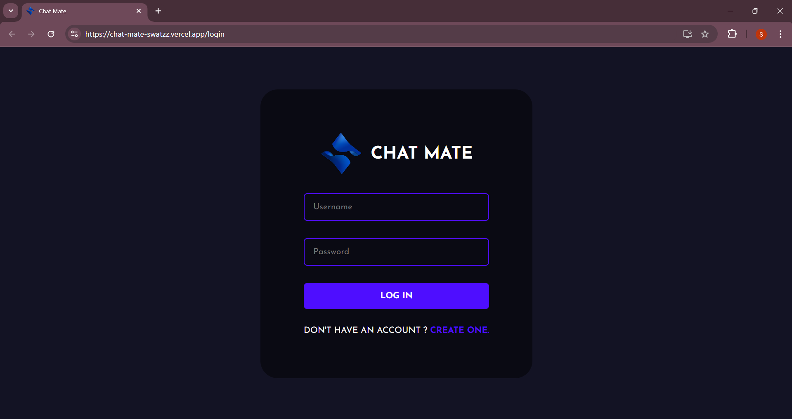
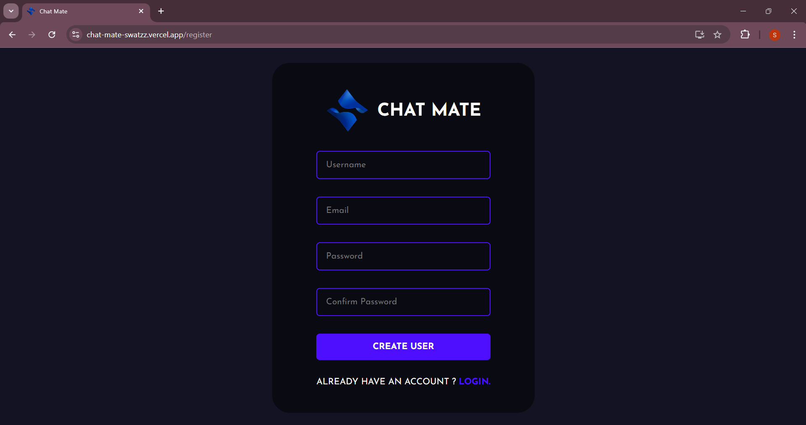
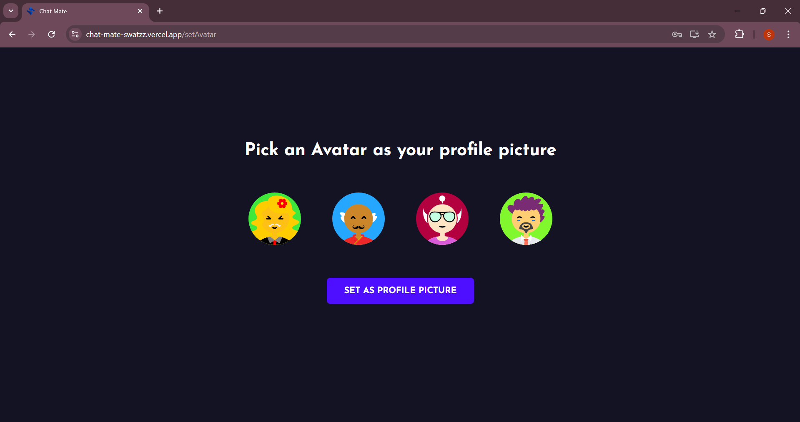
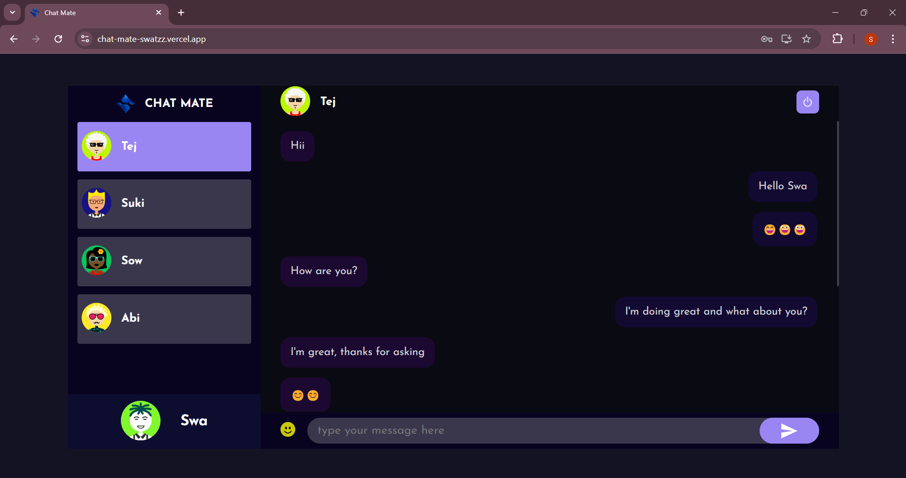

# Chat Mate

### Logo


**Live Demo:** [Chat Mate Live](https://chat-mate-swatzz.vercel.app/) 
## Table of Contents

- [About the Project](#about-the-project)
- [Features](#features)
- [Tech Stack](#tech-stack)
- [Screenshots](#screenshots)
- [Getting Started](#getting-started)
- [Usage](#usage)
- [Contributing](#contributing)
- [License](#license)
- [Contact](#contact)

## About the Project

Chat Mate is a real-time chat application that facilitates instant user communication, providing a flawless and responsive chat experience. The app allows users to send and receive messages in real-time, ensuring a smooth and engaging interaction.

## Features

- **Real-Time Communication:** Instant messaging with live updates.
- **User Authentication:** Secure user registration and login.
- **Avatar Selection:** Customize user profiles with avatar selection.
- **Responsive Design:** Accessible across multiple devices.

## Tech Stack

- **Frontend:** React JS
- **Backend:** Node.js, Express.js
- **Database:** MongoDB
- **Real-Time Communication:** Socket.io
- **Unique Identifiers:** UUID

## Screenshots

### 1. Login Page


### 2. Register Page


### 3. Avatar Selection Page


### 4. Chat Page



## Getting Started

### Prerequisites

- Node.js & npm
- MongoDB
- Git

### Installation

1. Clone the repository:
   ```bash
   git clone https://github.com/your-username/Chat-Mate.git
   ```

2. Navigate to the project directory:
   ```bash
   cd Chat-Mate
   ```

3. Install dependencies for both client and server:
   ```bash
   cd client
   npm install
   cd ../server
   npm install
   ```

4. Create a `.env` file in both client and server directories with the necessary environment variables.

### Running the App

1. Start the MongoDB server.

2. Run the backend server:
   ```bash
   cd server
   npm start
   ```

3. Run the frontend:
   ```bash
   cd client
   npm start
   ```

4. Open [http://localhost:3000](http://localhost:3000) in your browser.

## Usage

- **Register:** Create a new account with your email and password.
- **Avatar Selection:** Choose an avatar to personalize your profile.
- **Login:** Access your account using your credentials.
- **Chat:** Start chatting with other users in real-time.

## Contributing

Contributions are welcome! Please fork this repository and submit a pull request for any features, fixes, or suggestions.

## License

Distributed under the MIT License. See `LICENSE` for more information.

---
